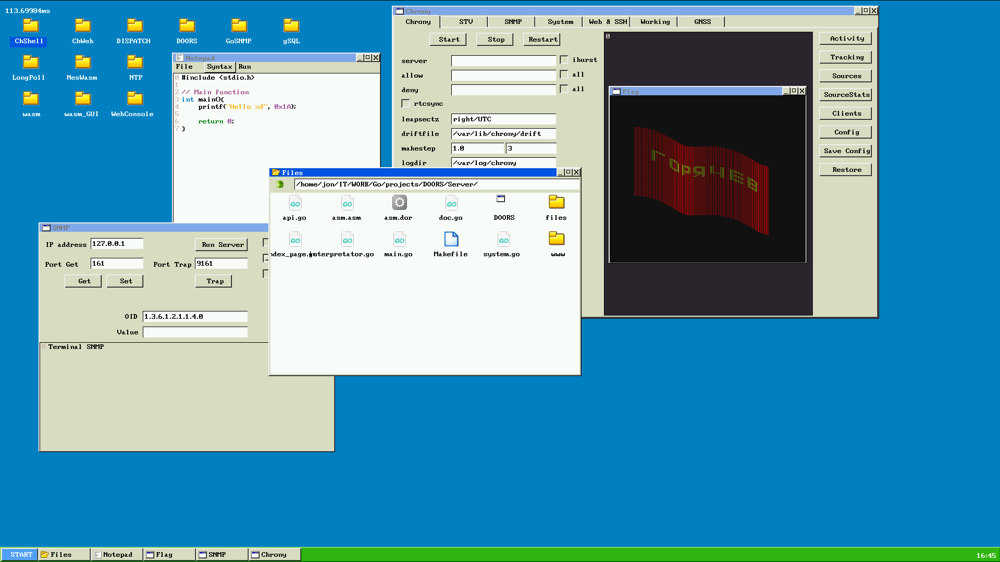
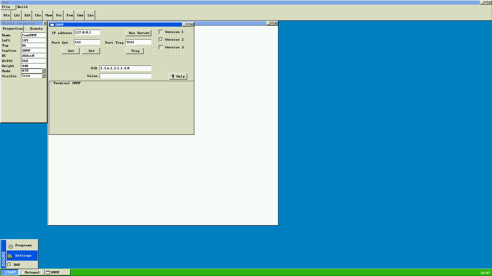
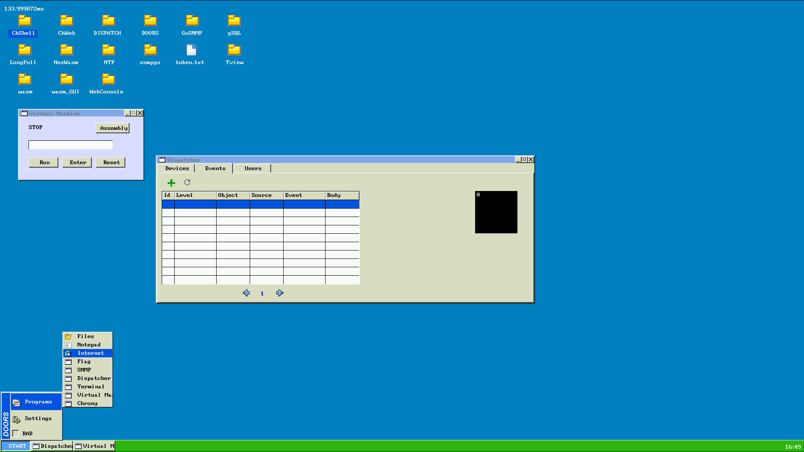

# Оконный графический интерфейс (для операционной системы Doors)

Оконный графический интерфейс для операционной системы. Версия для WebAssembly, запускается в браузере.

Содержит:
- базовую графическую библиотеку
- невытесняющий планировщик задач
- набор графических приложений

Написан на Go для WebAssembly.

Статус проекта: Завершен.

### Приложение состоит из двух частей:
- Back-end
	Это серверная часть, запускается на устройстве
	Написан на Go версии 1.18.1. 
	Файлы *.go лежат в каталоге ./Server
	Файл для сборки: ./Server/Makefile
	Результат сборки: ./Server/DOORS 
- Front-end
	Это клиентская часть, запускается в браузере
	Написан на Go
	Компилятор: TinyGo версия 0.28.1
	Цель компиляции: Wasm
	Файлы *.go лежат в корне каталога проекта ./
	Результат сборки: ./Server/www/DOORS.wasm
	Дополнительные библиотеки JavaScript:
	- для связки JavaScript браузера с файлом DOORS.wasm в каталоге ./www/scripts/wasm
	Стартовая страница ./www/index.html
	
	Справочно: Компилятор TinyGo применен в проекте, потому что он создает бинарные файлы меньшего размера. 
			   Исходный код можно компилировать обычным компилятором Go с указанием цели компиляции Wasm.

2023 Evgeny Goryachev    
Gor.Com 

