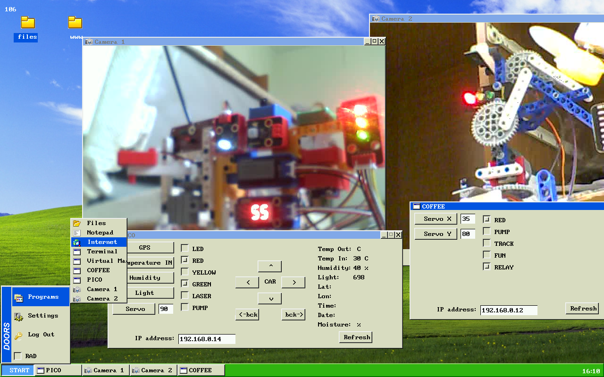

# Операционная система Doors в браузере




## Описание

**Операционная система Doors** - это версия ОС, которая работает в браузере благодаря технологии WebAssembly. 

Посмотреть, как работает ОС Doors, можно по ссылке [www.gorcom.online](http://www.gorcom.online)

## Запуск в Docker

Для запуска приложения в Docker выполните следующие команды:

```sh
# Запуск контейнера Docker
docker run -d -p 80:8081 --rm gorcomcomputing/doors

# Затем откройте в браузере ссылку http://localhost
```

# Функциональность

- **Базовая графическая библиотека**
- **Невытесняющий планировщик задач**
- **Набор графических приложений**
- **Управление Умным домом**
- **Просмотр IP-камер**

# Технологии

- **Язык программирования**: Go для WebAssembly
- **Статус проекта**: В разработке

# Архитектура приложения

## Back-end

- **Описание**: Серверная часть, запускаемая на устройстве.
- **Язык программирования**: Go версии 1.18.1.
- **Расположение файлов**: файлы *.go находятся в каталоге `./Server`.
- **Сборка**: осуществляется с помощью Makefile в каталоге `./Server`.
- **Результат сборки**: исполняемый файл `./Server/DOORS`.

## Front-end

- **Описание**: Клиентская часть, работающая в браузере.
- **Язык программирования**: Go.
- **Компилятор**: TinyGo версии 0.28.1 (цель компиляции - Wasm).
- **Расположение файлов**: файлы *.go находятся в корне проекта.
- **Результат сборки**: `./Server/www/DOORS.wasm`.
- **Дополнительные библиотеки JavaScript**: Для взаимодействия JavaScript в браузере с DOORS.wasm, находятся в каталоге `./www/scripts/wasm`.
- **Стартовая страница**: `./www/index.html`.

Компилятор TinyGo используется для создания меньших по размеру бинарных файлов. Исходный код также можно компилировать обычным компилятором Go с указанием цели компиляции Wasm.


# Сборка и управление

Для управления проектом используются следующие команды:
```sh
# Сборка и загрузка на сервер WASM
./make.py wasm

# Сборка и загрузка на сервер Web-сервера DOORS
./make.py srv

# Остановка Web-сервера DOORS
./make.py stop

# Запуск Web-сервера DOORS
./make.py start

# Проверка состояния Web-сервера DOORS
./make.py stat

# Перезапуск Web-сервера DOORS
./make.py restart

# Автоматическое добавление изменений в GitHub с комментарием
./make.py git "Комментарий"

# Создание Docker контейнера
./make.py docker

# Отправка контейнера в Docker Hub
./make.py hub
```

# Автор

2023-2024 Evgeny Goryachev
Gor.Com


